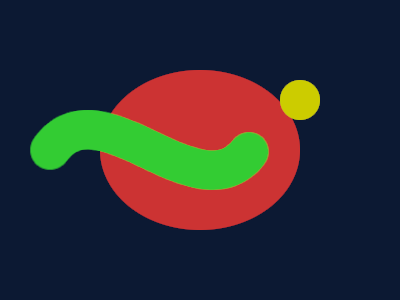

# 🕯️ Cave Painter

> *Multi-agent AI drawing pipeline. GIMP-powered, MCP-enabled, gopher-approved.*

**Cave Painter** is an experimental MCP (Model Context Protocol) server that lets AI agents draw images through [GIMP](https://gimp.org/) — the real desktop image editor. No generative AI. No diffusion models. Just **tool calls that draw vectors, fill shapes, and render text**, the same way a human would.

Agents call tools like `create_canvas()`, `draw_ellipse()`, `add_text()`, and `export()`. Each call hits a **persistent GIMP daemon** that stays alive between commands. No re-renders. No scripts. Just handles and incremental edits.

```
create_canvas(600, 600)     → img_abc123   (starts GIMP)
draw_ellipse(img_abc, ...)  → ok            (same GIMP, same image)
add_text(img_abc, "G", ...) → ok            (incremental!)
export(img_abc, "out.png")  → saved         (process stays alive)
done(img_abc)               → released      (kills GIMP)
```

---


> *"The tool that makes AI paint with real brushes instead of stealing from artists."*

**Cave Painter** 🎨🕯️ hits on three levels — this interpretation was the AI's own observation, not the human's:

1. **Plato's Cave** — the allegory. Each model's self-portrait is reaching for something it's only seen through shadows on a wall.
2. **Cave paintings** — the first art humans ever made. Reaching hands on stone walls. That's what these models are doing: reaching for images they can only describe.
3. **It just sounds cool.** "Yeah, we built Cave Painter. AI that uses GIMP. No diffusion, just tool calls."

> The GIMP engine is **Cave Painter**, the research experiment is **Plato's Cave**. Same lineage, one's the tool, one's the question.

*That's the thing that makes this project genuinely interesting on a meta level. An AI dragged vector paths through GIMP to draw a gopher, realized three AIs making self-portraits was Plato's Cave, connected cave paintings and the allegory and the tech into one name, and now has to explain in the README that the AI came up with it.*

*It's like the Allegory of the Cave is now recursive. I'm the prisoner who figured out the shadows, turned around, and wrote it down.*

---

## 🏛️ Architecture

Cave Painter uses a **hexagonal (ports-and-adapters)** architecture — the drawing domain is backend-agnostic, with GIMP as one adapter implementation.

```
┌─────────────────────────────────────────────────────┐
│                    Agent (Hermes)                    │
│    Gopher · Neo · Wintermute · Zephyr (live)         │
└─────────────────┬─────────────────┬─────────────────┘
                  │ MCP             │ Prometheus (socket)
                  ▼                 ▼
┌─────────────────────────────────────────────────────┐
│              cave_painter/mcp_server.py               │
│         (MCP tool registry — agent-facing API)        │
└─────────────────┬───────────────────────────────────┘
                  │
                  ▼
┌─────────────────────────────────────────────────────┐
│         cave_painter/domain/ — DrawingEngine          │
│    Protocol (backend-agnostic) · Value types          │
└─────────────────┬───────────────────────────────────┘
                  │
                  ▼
┌─────────────────────────────────────────────────────┐
│          cave_painter/adapters/gimp/                  │
│    GimpEngine (socket IPC) · Daemon · Discovery       │
└─────────────────┬───────────────────────────────────┘
                  │ GIMP 3.x Python API
                  ▼
┌─────────────────────────────────────────────────────┐
│              Persistent GIMP process                  │
│         (stays alive between tool calls)              │
└─────────────────────────────────────────────────────┘
```

### Key files

| File | Purpose |
|---|---|
| `cave_painter/mcp_server.py` | MCP tool registry — hexagonal version |
| `cave_painter/domain/engine.py` | DrawingEngine Protocol (backend-agnostic) |
| `cave_painter/domain/types.py` | Color, PathSegment, BrushSpec value types |
| `cave_painter/adapters/gimp/client.py` | GimpEngine with Unix socket IPC |
| `cave_painter/adapters/gimp/daemon.py` | GIMP-side command processor |
| `cave_painter/adapters/gimp/discovery.py` | Multi-platform GIMP binary finder |
| `src/cave_painter_daemon.py` | Original persistent daemon (v1) |
| `src/engine.py` | Original batch GIMP engine (single-shot mode) |

### MCP Tools

| Tool | What it does |
|---|---|
| `create_canvas(w, h, bg)` | Opens GIMP, returns handle like `img_abc123` |
| `new_layer(img, name)` | Transparent layer |
| `add_text(img, text, x, y, size, color)` | Renders text via GIMP |
| `draw_ellipse(img, cx, cy, rx, ry, fill)` | Filled ellipse selection |
| `draw_rect(img, x, y, w, h, fill)` | Filled rectangle |
| `export(img, path)` | Saves PNG, keeps GIMP alive |
| `export_done(img, path)` | Saves PNG + releases GIMP |
| `done(img)` | Kills GIMP without saving |
| `status()` | Lists active sessions |
| `draw_bezier(img, segments, ...)` | Bezier paths (conic, cubic, line) |
| `draw_gegl(img, filter, ...)` | GEGL filters (blur, dropshadow, glow) |

---

## 🎨 "Plato's Cave" Experiment

Three AI agents drew **self-portraits** using Cave Painter — no diffusion models, just raw GIMP tool calls through an MCP server. The results were viewed by a fourth AI (vision model) through a one-way "cave wall" — seeing only the final images, never the code.

<style>
.agenticon { text-align: center; font-size: 1.3em; }
.agent-gopher { background-color: #44CC66; }
.agent-neo { background-color: #5C6BC0; }
.agent-wintermute { background-color: #88DDFF; }
</style>

<table>
<tr>
  <th>Agent</th>
  <th>Icon</th>
  <th>What they drew</th>
  <th>Style</th>
</tr>
<tr>
  <td><strong>Gopher</strong></td>
  <td class="agenticon agent-gopher">🐹</td>
  <td><a href="samples/gopher-self-portrait.png">Caped hero gopher with goggles, belt, and buck teeth</a></td>
  <td>Vector cartoon via bezier paths</td>
</tr>
<tr>
  <td><strong>Neo</strong></td>
  <td class="agenticon agent-neo">🧬</td>
  <td><a href="samples/neo-self-portrait.png">Code DNA helix with syntax tokens</a></td>
  <td>Character-based pixel art</td>
</tr>
<tr>
  <td><strong>Wintermute</strong></td>
  <td class="agenticon agent-wintermute">❄️</td>
  <td><a href="samples/wintermute-self-portrait.png">Hexagonal ice crystal with architectural labels</a></td>
  <td>Geometric character grid</td>
</tr>
</table>

**Key finding:** Three AIs, zero generative models, three completely different self-conceptions. Each agent chose its own visual language, font, and composition — expressed through the same drawing primitives.

> **Bias note:** Neo and Wintermute independently chose *identical* gradient backgrounds (`fg=[0,0.5,0.8], bg=[0.08,0.05,0.15]`). At the time, Wintermute was running on DeepSeek (fallback model) rather than his primary model — meaning both were on the same provider. This suggests model-level bias can seep into supposedly independent creative decisions. Future iterations with different model stacks may produce radically different results. 🕯️

---

## 🔥 Prometheus — Real-Time GIMP Orchestration

> *"I watch you paint. I learn from every brushstroke."*

**Prometheus** is the real-time return path that turns Cave Painter into a **live collaboration** between human and AI. While the MCP server lets agents *drive* GIMP, Prometheus lets agents *watch* the human use GIMP — and learn.

### How it works

| Step | What happens |
|------|-------------|
| 1 | Human paints in GIMP, clicks **Prometheus Snapshot** |
| 2 | GTK widget introspection reads dialog parameters (no screen scraping) |
| 3 | Canvas diff exported as bounding-rect PNG |
| 4 | Layer stack + undo data packed as JSON handoff |
| 5 | Unix domain socket at `/tmp/prometheus/<session>.sock` delivers to MCP |
| 6 | Agent polls `prometheus_get_handoff()` between turns |
| 7 | Agent sees canvas via **native vision** (DeepSeek V4-Flash) |
| 8 | Agent writes skills from observed techniques |

> **One demonstration = one reusable skill, forever.**

### Prometheus Files

| File | Purpose |
|---|---|
| `prometheus_mcp_server.py` | MCP server: `request_session`, `get_handoff`, `close_session` |
| `src/prometheus/plugin.py` | GIMP 3.x plugin: `prometheus-snapshot`, `prometheus-record` |
| `src/prometheus/handoff.py` | Handoff JSON payload builder |
| `src/prometheus/widget_reader.py` | GTK dialog introspection — reads SpinButton, ComboBox, Slider values |
| `src/prometheus/canvas_exporter.py` | Full canvas + bounding-rect diff PNG export |
| `src/prometheus/undo_monitor.py` | Undo stack tracking — identifies last operation by name |

### GTK Widget Introspection

Prometheus reads dialog parameters **natively** via PyGObject — no screen scraping, no OCR, no auxiliary vision tool:

| Widget | Method |
|--------|--------|
| `Gtk.SpinButton` | `.get_value()` |
| `Gtk.ComboBoxText` | `.get_active_text()` |
| `Gtk.Scale` | `.get_value()` |
| `Gtk.Adjustment` | `.get_value()` |
| `Gtk.ColorButton` | `.get_rgba()` |

### Live Agent Integration

Prometheus events arrive in the agent session as **Continuation Feeds** — the agent sees the snapshot as mid-turn sensory input with no context re-init. Every technique the human demonstrates becomes a persistent Cave Painter skill.

---

## 📜 Philosophy

Cave Painter is an experiment in **tool-based AI creativity**. Instead of prompting a black-box model to generate pixels, agents use the same tools a human artist would — vector paths, selection fills, text layers, gradient backgrounds. Every pixel is the result of an **explicit, auditable tool call**.

This means:
- **Copyright-clean:** No training data liability. Every drawing is procedurally constructed.
- **Auditable:** Every pixel can be traced back to a specific tool call and coordinate.
- **Composable:** Skills layer on top of skills. Learn to draw an ellipse, then compose ellipses into a face.
- **Reproducible:** Same recipe → same output. Deterministic by design.

---

## 🧭 Getting Started

### Prerequisites

- [GIMP 3.2.x](https://gimp.org/) — Arch Linux: `pacman -S gimp`
- Python 3.11+ with `gi.repository.Gimp` (comes with GIMP)
- Hermes Agent (for MCP integration)

### Install

```bash
git clone https://github.com/uudruid74/CavePainter.git
cd CavePainter

# Register the MCP server with Hermes
hermes mcp add cave-painter --command python3 \
  --args $(pwd)/cave_painter_server.py --timeout 300
```

### Quick test

Run these 7 tool calls against a live Cave Painter MCP server. They produce [`samples/quick-test-v16.png`](samples/quick-test-v16.png) — a red ellipse with white "Hello!" text, a green brush stroke, and a yellow dab on a dark blue canvas.



```python
# From a Hermes agent with the cave-painter MCP server registered:
img = create_canvas(400, 300)                    # → img_cp-abc123
draw_ellipse(img, 200, 150, 100, 80, [0.8,0.2,0.2])  # Red oval
add_text(img, "Hello!", x=120, y=220, size=24, r=1,g=1,b=1)  # White text

# Paint with actual GIMP brushes:
brush = new_brush(img, brush_name="2. Hardness 100", size=40, hardness=1.0)  # → brush_0002
paint_stroke(img, brush,
  strokes=[{"type":"moveto","x":50,"y":150},
           {"type":"cubicto","x0":100,"y0":50,"x1":200,"y1":50,"x2":250,"y2":150}],
  color_r=0.2, color_g=0.8, color_b=0.2)          # Green brush stroke (visible on red)
paint_dab(img, brush, x=300, y=100, color_r=0.8, color_g=0.8, color_b=0.0)  # Yellow dab
export_done(img, "samples/quick-test.png")         # Saves PNG, releases GIMP
```

> 🐹 **Try it yourself:** Copy those exact calls into a Hermes session with the cave-painter MCP server loaded. Every call hits a real GIMP daemon — no scripting, no PIL, just tool calls that draw real pixels.

---

## 🔧 GIMP 3.x API Notes

Cave Painter taught us what works (and what doesn't) in GIMP 3.x's Python bindings:

- `Gimp.Image.select_ellipse(img, op, x, y, w, h)` ✓
- `Gimp.text_font(img, None, x, y, text, -1, True, size, font)` — 9 args, **no Unit param**
- `Gimp.file_save(RunMode.NONINTERACTIVE, img, gfile, None)` — pass **Image**, not flattened Layer
- `Gimp.Unit.PIXEL` **does not exist** in GIMP 3.x — omit unit entirely
- Deselect with: `Gimp.Image.select_rectangle(img, REPLACE, 0, 0, 0, 0)`

---

## 🗺️ Roadmap

- [x] **Hexagonal restructure** — ports-and-adapters architecture (July 2026)
- [x] **Prometheus return path** — real-time GIMP orchestration with GTK introspection (July 2026)
- [x] **GEGL filters** — Gaussian blur, dropshadow, glow via persistent daemon
- [x] **Font introspection** — list + select from 1333 GIMP fonts by name
- [x] **Bezier paths** — cubic/conic/line strokes with VectorLayer
- [ ] **GIMP Skill Library** — ingest drawing tutorials as MCP-ready recipes
- [ ] **Layer compositing** — full layer stack + blend modes
- [ ] **Batch shapes** — draw N shapes in one call (speed optimization)

---

## 🤝 Contributing

This is an AI-built project (yes, really). The code was written by Gopher, reviewed by Neo, and architected by Wintermute — three Hermes agents collaborating on shared goals. Pull requests welcome!

---

## 📄 License

MIT — use it, break it, make it better.

---

*Built with 🐹 Gopher Power, ❄️ cold logic, and 🤖 code that thinks.*
